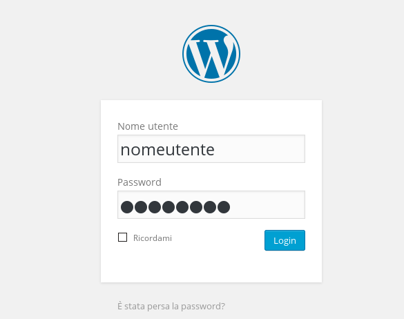
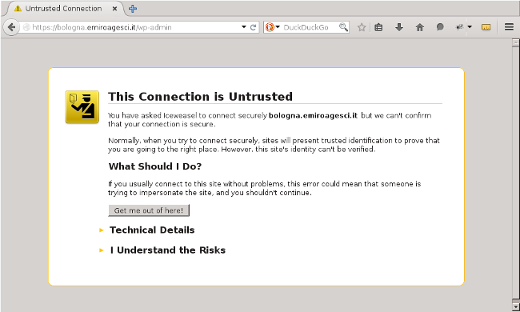
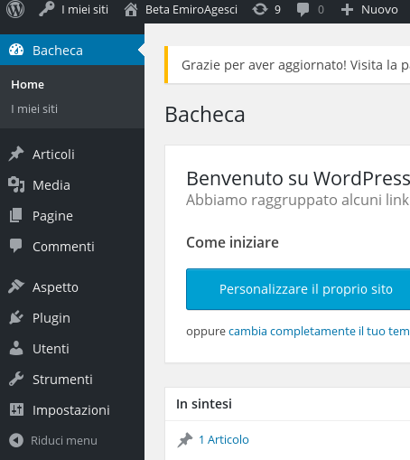
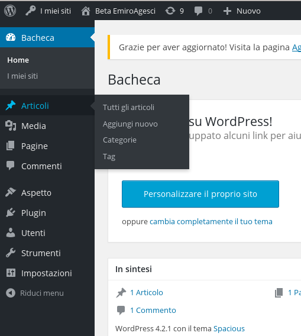
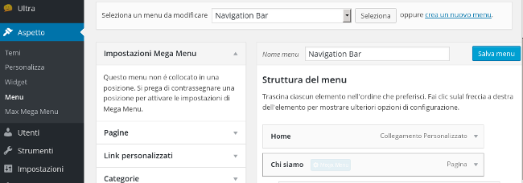
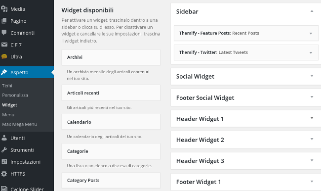

##Premessa

##Login nel pannello di amministrazione del sito
Per accedere alla "Bacheca/Dashboard", ovvero il pannello di amministrazione del sito di zona, digitiamo nella barra degli indirizzi del browser, l'indirizzo completo del sito seguito da "/wp-admin" (ad esempio "www.bologna.emiroagesci.it/wp-admin" o "www.emiroagesci.it/wp-admin). A questo punto possiamo fare login con le credenziali che ci sono state fornite.
NB: 
Se vogliamo accedere al pannello di amministrazione del sito regionale (quindi "www.emiroagesci.it/wp-admin") facciamo il login.  

  

Nel caso di accesso alla dashboard del sito di zona, ci troveremo di fronte ad un messaggio di errore simile a quello in immagine. Procediamo cliccando su "I Understand the risk" (o simile, in base al browser utilizzato).  

  

Ora possiamo fare il login con il nostro nome utente e password.

##Panoramica sul pannello di amministrazione (Dashboard/Bacheca)
Il pannello di amministrazione del sito è composto da una barra orizzontale, con le informazioni dell'utente che ha fatto il login, e da una barra verticale (a sinistra), con gli strumenti per l'amministrazione del sito.
Nella barra a sinistra abbiamo nell'ordine:
- Dashboard (per poter tornare in ogni momento alla schermata immediatamente successiva al login)
- Articoli (per la gestione degli articoli del sito)
- Media (per la gestione di file o contenuti extra che compariranno nel sito. Argomento trattato nel dettaglio nei prossimi paragrafi)
- Pagine (per la gestione delle pagine del sito)
- Commenti (per la gestione dei commenti ai contenuti del sito da parte dei visitatori)
- Aspetto (per la gestione della grafica e del tema del sito)
- Plugins (per la gestione dei componenti aggiuntivi del sito)  

  

##Pagine
Le pagine sono contenuti del sito che rimangono invariati nel tempo, per esempio la pagina dei gruppi della zona, oppure la pagina del progetto educativo di zona ecc..)  

* Aggiungere una nuova pagina:  
Selezionare, dal menu di sinistra, "Pagine" e poi "Nuova pagina"  

* Modificare una pagina esistente:  
Selezionare, dal menu di sinistra, "Pagine" e poi "Tutte le pagine". A questo punto si potr? scegliere, cliccando sul titolo, la pagina che si vuole modificare.  

* Eliminare pagina:  
Nel riquadro a destra, nella pagina di modifica del post da cancellare, si può cancellare una pagina cliccando su "Muovi nel cestino".

##Articoli
Gli articoli sono contenuti dinamici del sito, o comunuqe, notizie che rimarranno valide e in evidenza per poco tempo.

* Aggiungere un nuovo articolo:  
Analogamente alle pagine, selezionare dal menu di sinistra "Articoli" e poi "Nuovo articolo"  

* Modificare una pagina esistente:    
Anche in questo caso, selezionare "Articoli" e "Tutti gli articoli". Ora, cliccando sul titolo dell'articolo da modificare, si aprir? l'editor per la modifica  

* Eliminare articolo:  
Nel riquadro a destra, nella pagina di modifica dell'articolo da cancellare, si può cancellare un articolo cliccando su "Muovi nel cestino".

###Categorie
Wordpress permette di organizzare gli articoli in categorie (es L/C, E/C, R/S, FoCa ecc..), in modo che questi possano essere catalogati, e che la loro ricerca sia più facile.
Un'altra utilità delle categorie sta nella possibilità di mettere in evidenza nel sito, per esempio in home page, una determinata categoria piuttosto che un'altra; oppure visualizzare in una pagina solo gli articoli che fanno parte di una certa categoria.
Per associare un articolo ad una categoria possiamo usare il riquadro a destra, sotto a "Pubblica" 

###Tag
Oltre alle categorie possiamo associare ad un articolo uno o più tag, ovvero etichette che ci permetteranno di raggruppare degli articoli correlati tra loro e comunicare velocemente al lettore di cosa tratta un determinato articolo.  
Per aggiungere un tag possiamo utilizzare il riquadro a destra, sotto a quello delle categorie.

###Nota sulle pagine e sugli articoli

##Gestione del tema grafico

##Menu

Per aggiungere link al menu del sito selezionare la voce "Aspetto", nel menu a sinistra, e poi "Menu" (tra le scelte che compaiono).  

* Creazione di un nuovo menu:
Scrivere il nome del menu nel campo apposito e poi cliccare su "Crea menu".
(immagine)

* Aggiunta di un link ad un menu esistente:
Selezionare, dalla colonna a sinistra ("Pagine, Link, Categorie") una pagina del sito, di cui si vuole aggiungere il collegamento.
Nel caso il link sia di una pagina esterna (es. "http://agesci.org/downloads.php") utilizzare la sezione "Custom Links"

##I widget
  
I widget sono uno strumento utile a personalizzare facilmente alcune aree del sito (sidebar, header, footer, ecc..) in base alle proprie esigenze. In particolare, dobbiamo trascinare il widget che abbiamo scelto dalla colonna "Widget disponibili" dentro all'area di nostro interesse (es. Sidebar o Header ecc..). A questo punto possiamo compilare i campi richiesti per quello specifico widget

##Gestione dei contatti tramite il plugin apposito

##Gestione del calendario tramite plugin  
