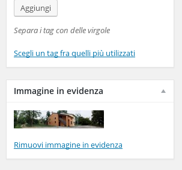

##Articoli
Gli articoli sono contenuti dinamici del sito, o comunuqe, notizie che rimarranno valide e in evidenza per poco tempo.

* Aggiungere un nuovo articolo:  
Analogamente alle pagine, selezionare dal menu di sinistra "Articoli" e poi "Nuovo articolo"  

* Modificare un articolo esistente:    
Anche in questo caso, selezionare "Articoli" e "Tutti gli articoli". Ora, cliccando sul titolo dell'articolo da modificare, si aprirà l'editor per la modifica  

* Eliminare articolo:  
Nel riquadro a destra, nella pagina di modifica dell'articolo da cancellare, si può cancellare un articolo cliccando su "Muovi nel cestino".

* Immagini in evidenza
* Per aggiungere un'immagine in evidenza in un articolo utilizzare il box in basso a destra "Immagine in evidenza". Tramite "Imposta l'immagine in evidenza" scegliere un'immagine tra quelle già caricate oppure caricarne una dal proprio computer.

