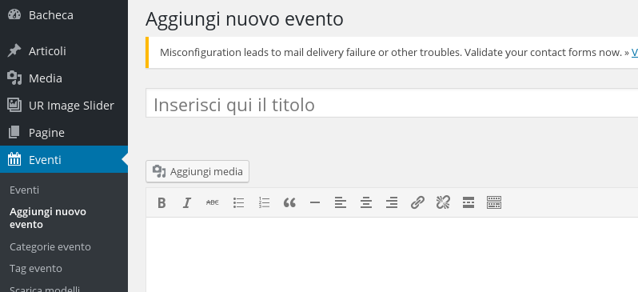
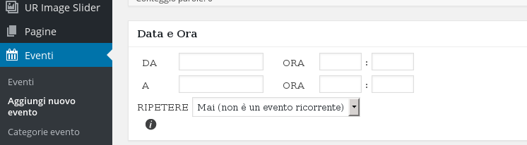

##Gestione del calendario tramite plugin

Per aggiungere un nuovo evento, selezionare "Eventi" e poi "Aggiungi nuovo evento" nel menu a sinistra

Dopo aver scritto il titolo e un testo di descrizione dell'evento, scegliere una data di inizio, data di fine e orario dell'evento tramite il box sottostante.

