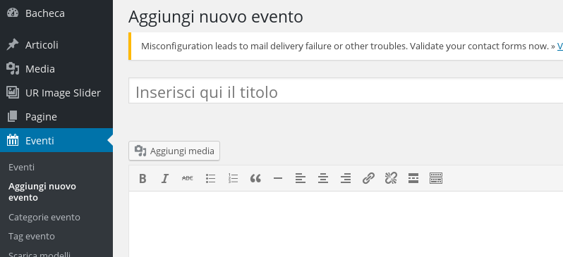
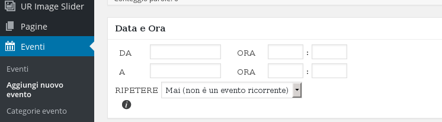
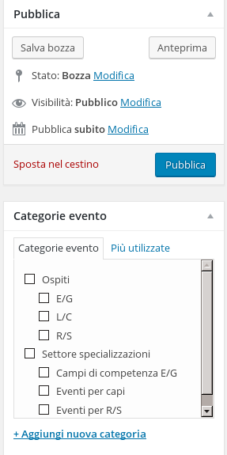

##Gestione del calendario tramite plugin

Per aggiungere un nuovo evento, selezionare "Eventi" e poi "Aggiungi nuovo evento" nel menu a sinistra

Dopo aver scritto il titolo e un testo di descrizione dell'evento, scegliere una data di inizio, data di fine e orario dell'evento tramite il box sottostante.

Per la gestione del calendario è importante selezionare anche, per ogni evento, una categoria; in questo modo gli eventi avranno i colori relativi alla categoria (branca per esempio) specificata.
Un'altra utilità delle categorie è poter mostrare in una pagina solo gli eventi di una determinata categoria (come succede per le pagine del settore specializzazioni).
Per un evento è possibile scegliere più di una categoria

