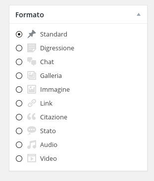

# Formato degli articoli

In base al contenuto di un articolo Wordpress può mostrarlo graficamente in diversi modi.

Selezioniamo dal box a destra il formato dell'articolo.
Ad esempio inserendo nell'articolo il link di un video di youtube e selezionando il formato "Video" Wordpress rappresenterà la pagina in modo specifico per il video. Lo stesso vale per gli altri formati

