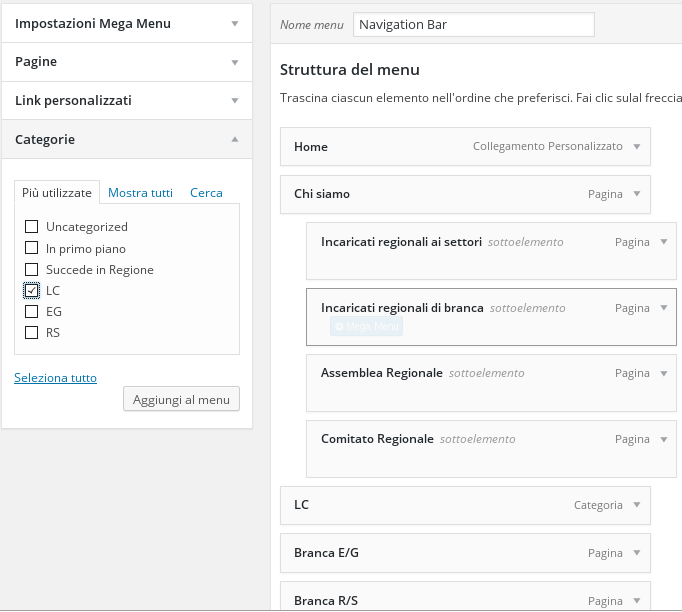

##Menu

Per aggiungere link al menu del sito selezionare la voce "Aspetto", nel menu a sinistra, e poi "Menu" (tra le scelte che compaiono).  

* Creazione di un nuovo menu:
Scrivere il nome del menu nel campo apposito e poi cliccare su "Crea menu".
(immagine)

* Aggiunta di un link ad un menu esistente:
Selezionare, dalla colonna a sinistra ("Pagine, Link, Categorie") una pagina del sito, di cui si vuole aggiungere il collegamento.
Nel caso il link sia di una pagina esterna (es. "http://agesci.org/downloads.php") utilizzare la sezione "Custom Links."

* Se, tramite un link del menu, si vogliono visualizzare tutti gli articoli di una determinata categoria, utilizziamo la voce "Categorie" scegliendo quella che ci serve e "Aggiungi al menu"
Ad esempio nell'immagine seguente stiamo inserendo nel menu un link chiamato "LC" al click del quale vogliamo visualizzare tutti gli articoli che hanno come categoria "LC".  
