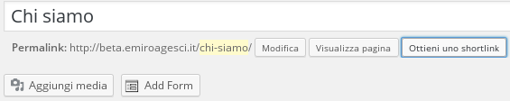

##Pagine
Le pagine sono contenuti del sito che rimangono invariati nel tempo (per esempio la pagina dei gruppi della zona, oppure la pagina del progetto educativo di zona ecc..)  

* Aggiungere una nuova pagina:  
Selezionare, dal menu di sinistra, "Pagine" e poi "Nuova pagina".  
Dopo aver scritto il contenuto della pagina ques'ultima deve essere linkata all'interno del sito.  
Nel caso vogliamo associare la pagina ad un link del menu principale del sito si veda la sezione [menu](menu.md). Nel caso invece vogliamo creare un link in un altra pagina o articolo che rimandi alla pagina appena creata ci copiamo il link cliccando su "ottieni uno shortlink" come da immagine e lo utilizziamo nell'altra pagina/articolo.  

* Modificare una pagina esistente:  
Selezionare, dal menu di sinistra, "Pagine" e poi "Tutte le pagine". A questo punto si potrà scegliere, cliccando sul titolo, la pagina che si vuole modificare.  

* Eliminare pagina:  
Nel riquadro a destra, nella pagina di modifica del post da cancellare, si può cancellare una pagina cliccando su "Muovi nel cestino".
