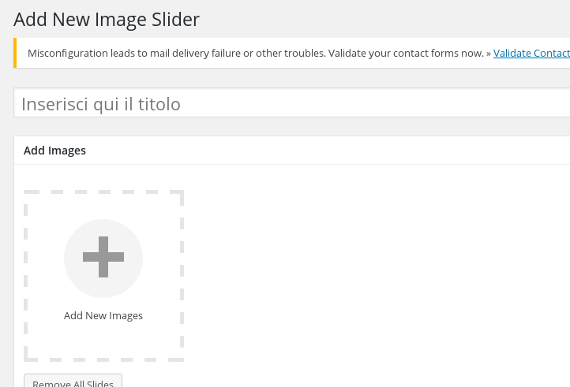

# Slider

Il plugin UR Slider Responsive permette di creare gallerie fotografiche.

Per creare una nuova galleria cliccare su "Add New Image Slider". A questo punto compilare il campo "Inserisci qui il titolo" e aggiungere le immagini alla galleria tramite il "+" nella sezione "Add Images"

