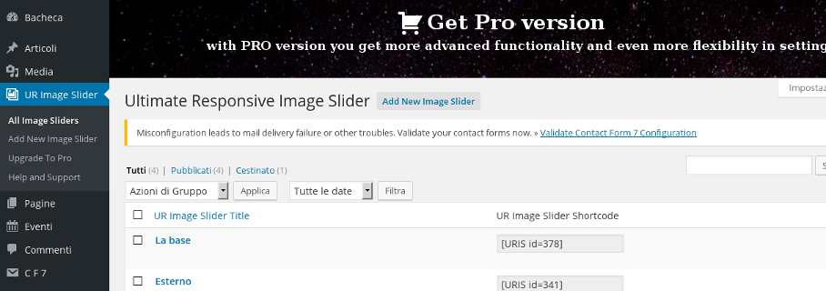

# Slider

Il plugin UR Slider Responsive permette di creare gallerie fotografiche.

Per creare una nuova galleria cliccare su "Add New Image Slider". A questo punto compilare il campo "Inserisci qui il titolo" e aggiungere le immagini alla galleria tramite il "+" nella sezione "Add Images"

Per salvare la nuova galleria creata cliccare su "Pubblica".

**Per poter inserire la galleria all'interno di un articolo è necessario copiare il codice della galleria all'interno dell'articolo stesso** (ad esempio "[URIS id=413]") e poi salvare con "Aggiorna"

