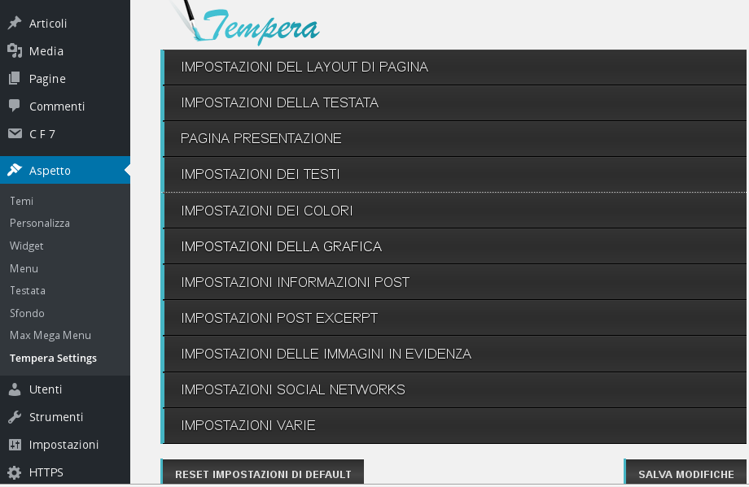
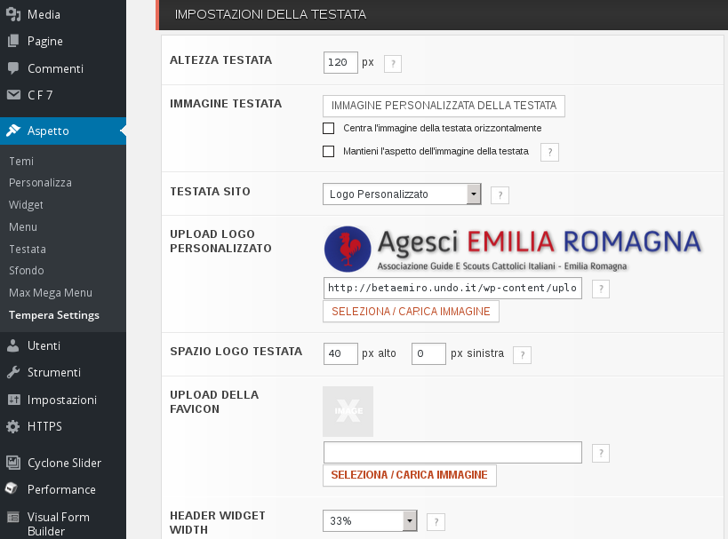
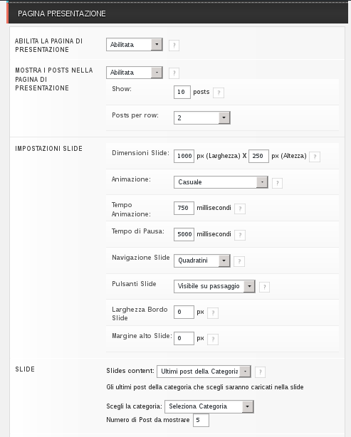
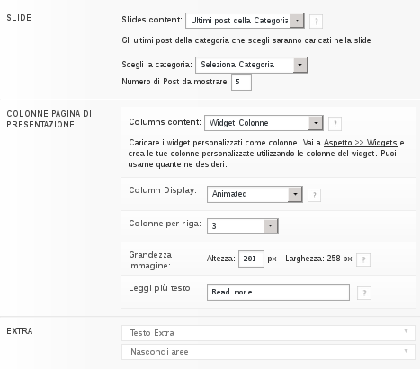

#Gestione del tema grafico (per i siti di zona)

In ambiente Wordpress un tema consiste nell'aspetto del sito, nella sua interfaccia grafica, nel modo in cui esso viene visualizzato dall'utente.

Esiste una vastissima quantità di [temi per Wordpress](https://wordpress.org/themes/); ne consigliamo uno in particolare, già installato e configurato sul sito ([tempera](https://wordpress.org/themes/tempera/)).

##Personalizzazione di Tempera
Per andare a personalizzare il tema consigliato utilizziamo il menu di sinistra della nostra dashboard posizionandoci su "Aspetto" e cliccando su "Tempera Settings".
  

####Impostazioni del Layout di Pagina
Scegliendo la riga "Impostazioni del Layout di Pagina" possiamo modificare la struttura delle pagine del nostro sito, ovvero: il contenuto sviluppato su una colonna, su due colonne con a destra una barra verticale, su due colonne con a sinistra una barra verticale e così via...
Possiamo anche regolare la larghezza che avrà il nostro sito con la barra apposita.  
  

####Impostazioni della Testata
Le "Impostazioni della Testata" riguardano la parte superiore del sito (header), nello specifico l'area contenente il logo.  
  
Possiamo ora modificare il logo che comparirà nella parte superiore di ogni pagina del sito scrivendo il link dell'immagine scelta nello spazio affianco a "Upload logo personalizzato" (per caricare il file vedi paragrafo su [immagini e altri contenuti](altri_contenuti.md))  

####Pagina di presentazione
La pagina di presentazione consiste nello slider, i tre box con le notizie delle branche e il resto dei contenuti della home page (ultimi articoli pubblicati).  

#####Gestione dello slider

Lo slider può essere comodo per mostrare le notizie in primo piano corredate da un'immagine; per un' impostazione del genere in "slide" -> "slide content" selezioniamo "Ultimi post della categoria" e in "scegli la categoria" per esempio scegliamo "In primo piano".
Ora lo slider mostrerà i contenuti della categoria "In primo piano".  
NB: Verranno visualizzati solo gli articoli con una immagine (paragrafo [Articoli](articoli.md) per vedere come associare un'immagine ad un articolo).  
E' preferibile immagini che verranno utilizzate nello slider abbiano proporzioni "orizzontali", quindi con larghezza maggiore dell'altezza.  

#####Colonne di presentazione
Le "Colonne di presentazione" sono l'area personalizzabile sottostante allo slider.
Per aggiungere contenuti in quest'area, andando nella pagina dei widget ("Aspetto" -> "Widget"), trasciniamo i widget che ci interessano in "Colonne pagina di presentazione".
Può essere per esempio uno strumento utile per mettere in evidenza le notizie delle branche. In tal caso trascineremo tre volte il widget "Category Post" e lo configureremo scegliendo la categoria relativa ad una branca ogni volta.  

#####Impostazioni dei colori
Per impostare i colori del sito (dello sfondo, dei testi, dei link ecc...) selezioniamo "Impostazione dei colori".
Posizionando il mouse su ogni campo per il colore (con il codice specifico in esadecimale) visualizziamo a cosa si riferisce un determinato colore. Per modificarlo clicchiamo sul codice esadecimale (es. #f3e24d) e comparirà una "tavoletta dei colori"; a questo punto selezioniamo il colore che preferiamo.