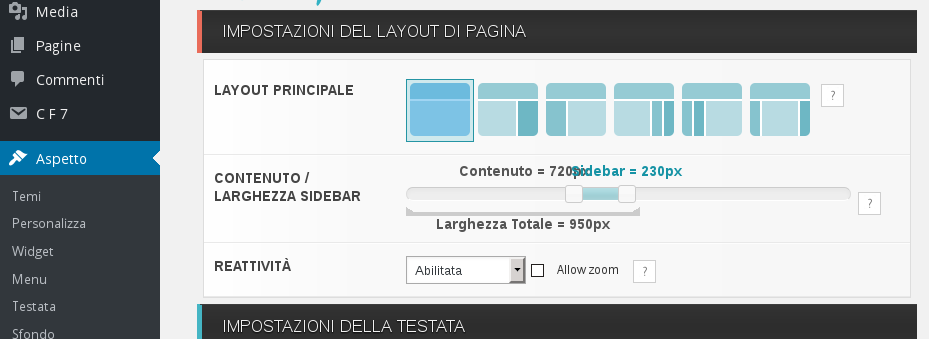

#Gestione del tema grafico (per i siti di zona)

In ambiente Wordpress un tema consiste nell'aspetto del sito, nella sua interfaccia grafica, nel modo in cui esso viene visualizzato dall'utente.

Esiste una vastissima quantità di [temi per Wordpress](https://wordpress.org/themes/); ne consigliamo uno in particolare, già installato e configurato sul sito ([tempera](https://wordpress.org/themes/tempera/)).

##Personalizzazione di Tempera
Per andare a personalizzare il tema consigliato utilizziamo il menu di sinistra della nostra dashboard posizionandoci su "Aspetto" e cliccando su "Tempera Settings".

